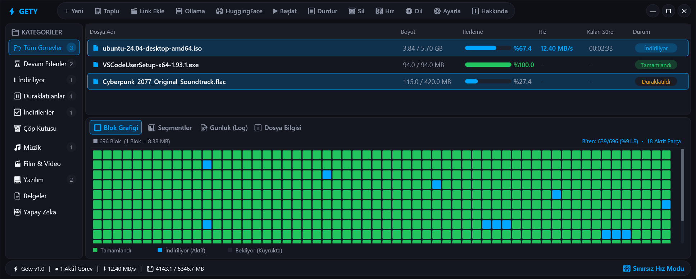
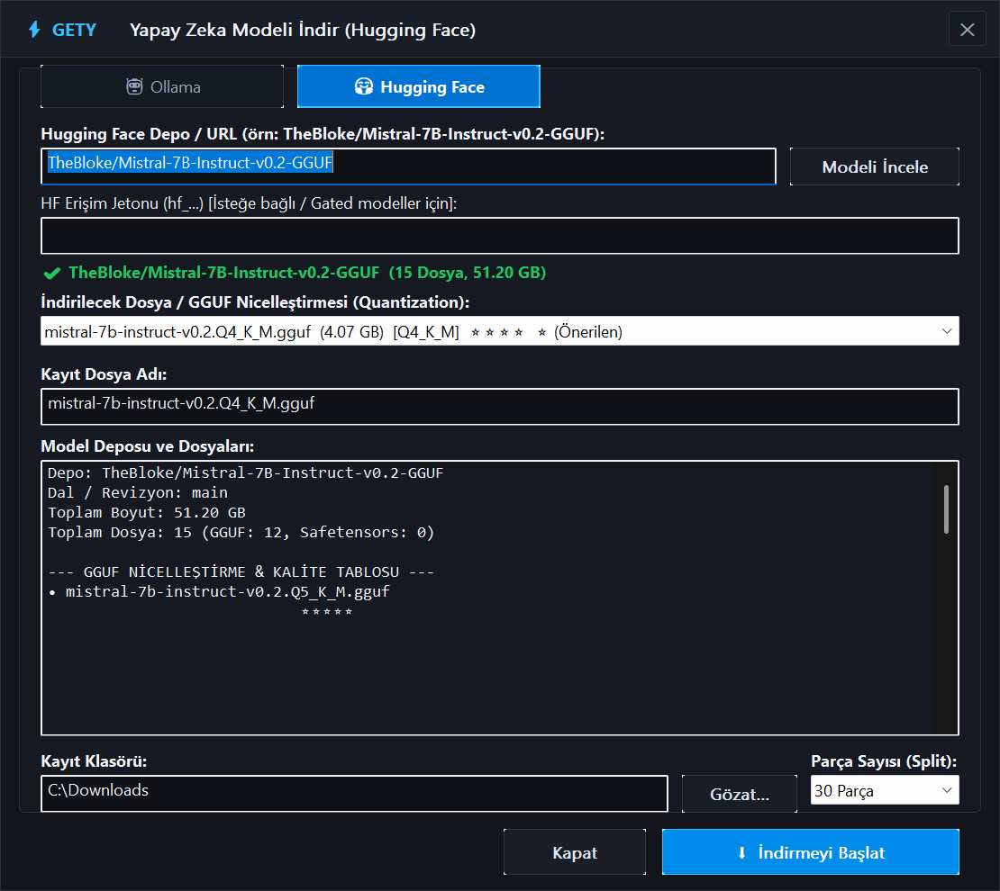
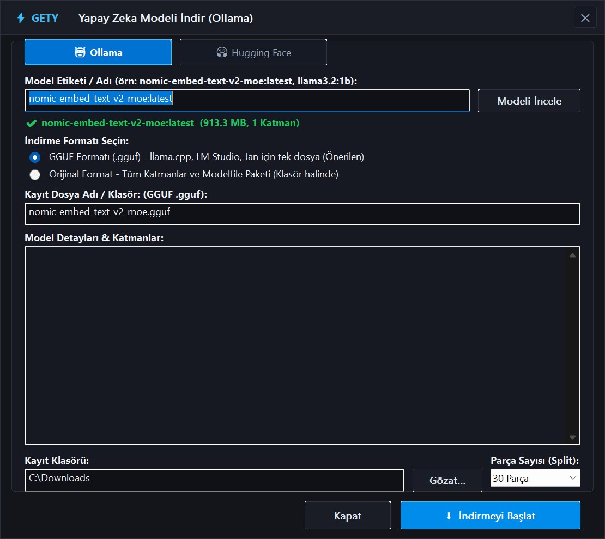

# ⚡ Gety - Ultra-Fast C++20 Native Download Manager & AI Model Downloader

<p align="center">
  
</p>

<p align="center">
  <a href="LICENSE"></a>
  
  
  
  
  
</p>

**Gety** is a high-performance, lightweight Windows download manager written in pure **C++20** with native **Win32** and **Direct2D** graphics. Designed for maximum speed and zero bloat, Gety features a multi-threaded segmented download engine, deep integration for downloading AI models (**Ollama** and **Hugging Face**), media extraction, a floating desktop drop target, and military-grade DPAPI AES-256 encrypted task persistence.

---

## 🌟 Key Highlights

- **Pure Native C++20 & Win32**: No Electron, no Qt, no bloated web views. Executable is self-contained (~1.7 MB) and statically linked (`/MT`). Idle RAM usage is only ~8–15 MB.
- **1 to 30 Segmented Download Engine**: Dynamically splits files across multiple concurrent HTTP/HTTPS connections (`HTTP/1.1 206 Partial Content`).
- **Zero-Wait Pre-Allocation**: Files are pre-allocated on disk (`SetEndOfFile`). Chunks write directly to designated offsets with overlapped asynchronous I/O. When the last byte completes, your file is immediately ready without merge delays.
- **Native AI Model Downloader**:
  - 🤖 **Ollama Registry Support**: Download LLM weights directly by model name (e.g. `llama3:8b`, `deepseek-r1:8b`, `nomic-embed-text-v2-moe:latest`) in raw blob or single GGUF formats.
  - 🤗 **Hugging Face Hub Support**: Fetch any repository or model (e.g. `unsloth/DeepSeek-R1-Distill-Qwen-7B-GGUF`), resolve direct Cloudflare/S3 CDN endpoints, filter files, authenticate private/gated models with Bearer tokens, and leverage smart GGUF quantization scoring.
- **Direct2D Visual Download Matrix**: Real-time hardware-accelerated grid displaying active, completed, and pending byte ranges with zero latency.
- **Floating Desktop Drop Zone**: Semi-transparent HUD overlay that floats over games or browser windows, accepting drag-and-drop links with live throughput telemetry.
- **Encrypted Task Storage**: State and download history are protected with Windows Data Protection API (DPAPI AES-256) inside clean JSON files.
- **Commercial Friendly**: Released under the permissive **MIT License**.

---

## 📸 Screenshots

### 1. Main Dashboard & Visual Matrix
Hardware-accelerated Direct2D segmented progress grid, transfer telemetry, category tree, and floating HUD target.


### 2. Hugging Face AI Model Downloader
Search and browse Hugging Face repositories, inspect file trees, filter GGUF quantizations with automated star ratings (⭐ 1-5), and download directly via accelerated CDNs.


### 3. Ollama AI Model Downloader
Download Ollama models seamlessly with tag resolution, manifest exploration, and layer extraction.


---

## 🧠 AI Model Hub Features

Gety brings AI model acquisition directly into a fast, multi-threaded native download manager:

### 🤗 Hugging Face Integration
- **Model Resolution**: Enter any Hugging Face repo ID (`owner/model-name`) or branch.
- **Smart GGUF Quantization Scoring**: Automatically evaluates quantization formats (`Q4_K_M`, `Q5_K_M`, `Q8_0`, `IQ4_XS`, etc.) and assigns a **1 to 5 Star Rating** to recommend the optimal quality-to-VRAM ratio.
- **Direct CDN Redirection**: Bypasses rate limits and redirects directly to high-throughput Cloudflare / CloudFront / S3 edge endpoints.
- **Private & Gated Models**: Supply personal Hugging Face tokens (`hf_...`) to access gated models (like Llama 3, Gemma, etc.).

### 🤖 Ollama Hub Integration
- **Direct Manifest Fetching**: Communicates with the Ollama Docker Registry API (`registry.ollama.ai`) using native WinHTTP and Windows Schannel TLS.
- **Format Flexibility**: Download models as individual Ollama layers or package them into standalone `.gguf` files for direct use with `llama.cpp`, `KoboldCPP`, or `LM Studio`.

---

## ⚡ Technical Architecture

| Component | Implementation Details |
| :--- | :--- |
| **Language & Standard** | ISO C++20 (`/std:c++20`, `/permissive-`, MSVC 2022) |
| **GUI Framework** | Native Win32 API, Custom Dark Theme, Direct2D & DirectWrite |
| **Network Stack** | Microsoft WinHTTP with hardware-accelerated Windows Schannel (TLS 1.2 / 1.3) |
| **File I/O** | Win32 Asynchronous Overlapped I/O, Sparse File & Pre-allocation (`SetFileValidData`) |
| **Concurrency** | `std::jthread`, `std::mutex`, `std::condition_variable`, lock-free atomics |
| **Security & Cryptography**| Windows Crypt32 DPAPI (AES-256-CBC) |
| **Persistence** | Portable zero-registry `portable_data/tasks.enc.json` |
| **External Media** | Native integration with `yt-dlp` for video & audio stream extraction |

---

## 🛠️ Building from Source

### Prerequisites
- **Operating System**: Windows 10 / 11 (x64)
- **Compiler**: Visual Studio 2022 (MSVC v143) with C++20 Desktop Development workload
- **Build System**: CMake 3.20 or newer

### Build Steps

```powershell
# Clone the repository
git clone https://github.com/geataa/Gety.git
cd Gety

# Configure CMake with Visual Studio 2022 x64 generator
cmake -B build -G "Visual Studio 17 2022" -A x64

# Compile Release binary
cmake --build build --config Release
```

The compiled standalone executable will be generated at `build/Release/Gety.exe`.

### Running Automated Tests

Gety includes comprehensive engine tests (HTTP parsing, range calculations, DPAPI encryption, manifest validation):

```powershell
cmake --build build --config Release --target test_engine
.\build\Release\test_engine.exe
```

---

## 🤝 Acknowledgements & References

Gety's native AI model download capabilities were inspired by and reference the logic of two outstanding open-source projects:

1. **[akx/ollama-dl](https://github.com/akx/ollama-dl)** by [@akx](https://github.com/akx)
   - *Inspiration*: Ollama model manifest parsing, Docker/OCI registry layer negotiation, and blob-to-GGUF mapping concepts.
2. **[bodaay/HuggingFaceModelDownloader](https://github.com/bodaay/HuggingFaceModelDownloader)** by [@bodaay](https://github.com/bodaay)
   - *Inspiration*: Hugging Face API file tree resolution, direct CDN header following, and GGUF quantization scoring strategies.

Both projects provided tremendous architectural inspiration, which we reimplemented as pure native C++20 modules with multi-threaded WinHTTP streaming. Special thanks to the authors!

---

## 🤖 Vibe Coding with Google DeepMind Gemini 3.8

This project embraces the future of software engineering: **Gety was developed through Vibe Coding with Google DeepMind's Gemini 3.8 via Antigravity**.

- **Human Vision & Direction**: System architecture design, UX conception, performance specifications, and real-time validation by [@geataa](https://github.com/geataa).
- **AI Agentic Execution**: High-performance C++20 native code synthesis, Win32 message loop design, Direct2D rendering pipelines, and security implementations powered by **Gemini 3.8**.
- **Zero Hallucination Standard**: 100% verified with deterministic automated test suites and live execution benchmarks.

We believe in radical transparency: AI-assisted development empowers solo creators to deliver robust, industrial-grade native applications at breakneck speed.

---

## 📄 License

Gety is licensed under the **[MIT License](LICENSE)**. 

You are free to use, modify, distribute, and incorporate Gety into private and **commercial** projects with virtually no restrictions.

---

<p align="center">
  Crafted with ❤️ and C++20 by the <b>Gety Team</b>.
</p>
